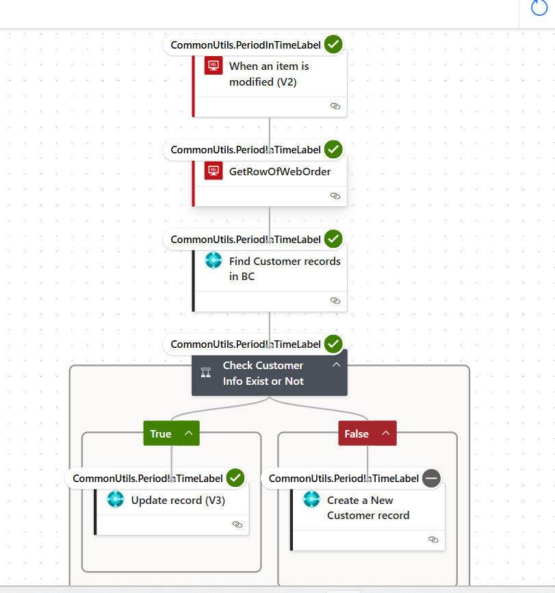
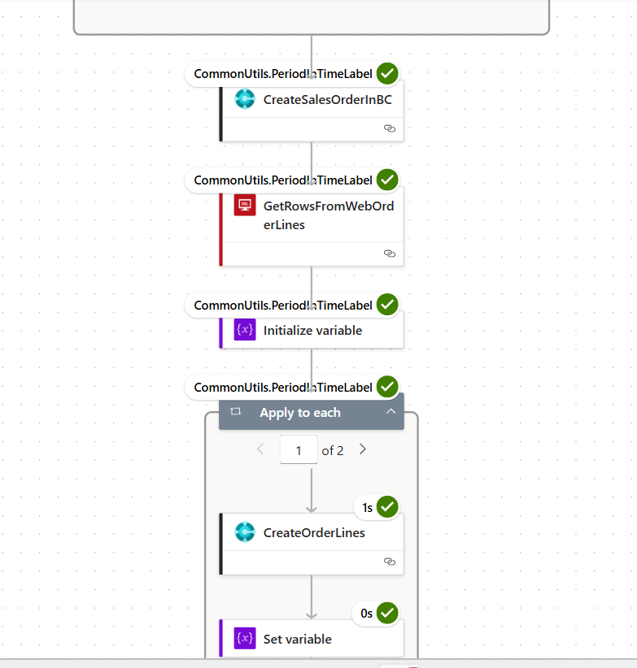
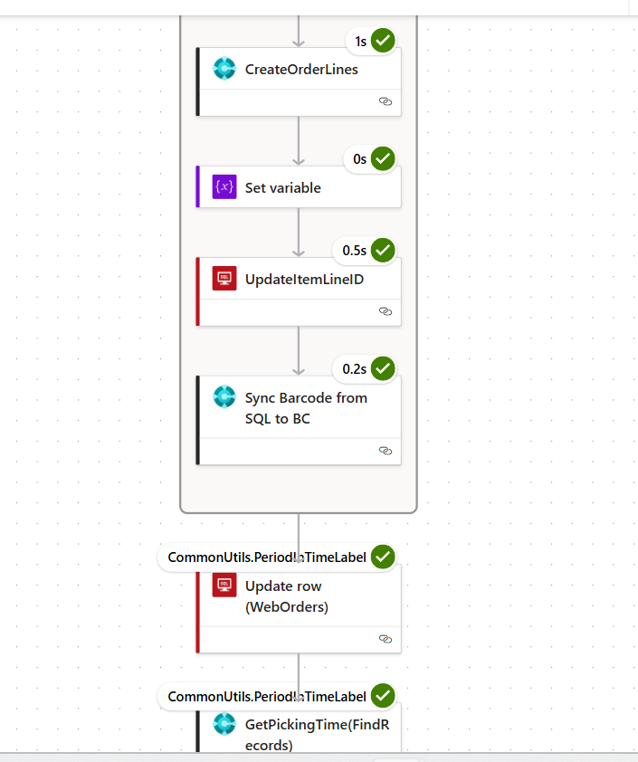

# 📘 Power Automate Flow: SyncBetweenSql&BC

This flow synchronizes approved Web Orders from a SQL Server database into Microsoft Dynamics 365 Business Central by creating Sales Orders and Lines. It also validates customer data and updates the source SQL record accordingly.

---

## 🔁 Trigger

### 🔹 Trigger: When an item is modified (V2)
- Source: SQL Server table `[dbo].[WebOrders]`
- Trigger condition: `Status = 'Approved'`
- Runs every 3 minutes

---

## 🔧 Step-by-Step Flow Logic

### 🔹 Step 1: GetRowOfWebOrder
- Retrieves the modified order row using its ID

### 🔹 Step 2: Find_Customer_records_in_BC
- Searches for a customer record in Business Central

### 🔹 Step 3: Check_Customer_Info_Exist_or_Not (Condition)
- If customer exists:
  - Proceed to create Sales Order
- Else:
  - Log or skip (depending on logic in branch)

---

## 🧾 Sales Order Creation

### 🔹 Step 4: CreateSalesOrderInBC
- Creates a new `Sales Header` in BC for the order

---

## 📦 Order Line Processing

### 🔹 Step 5: Get_rows_from_WebOrderLine
- Retrieves related order lines from SQL table `[dbo].[WebOrderLine]`

### 🔹 Step 6: GetPickingTime(FindRecords)
- (Optional) Gets time data for shipping or warehouse logic

### 🔹 Step 7: GetRowsFromWebOrderLines
- Possibly retrieves full line data for item population

### 🔹 Step 8: For_each (Loop through lines)
- Inside: `CreateSalesOrderLineInBC`
  - For each SQL line item:
    - Creates a corresponding `Sales Line` in BC
    - Matches with Sales Header by `Document No.`

---

## 📝 Post-Processing

### 🔹 Step 9: Update_row_(WebOrders)
- Updates the original SQL order:
  - Marks it as “Processed”
  - Saves new Business Central Order No.

### 🔹 Step 10: Condition
- (Optional) Add fallback / status report logic

---

## ✅ Summary

| Source | Target | Purpose |
|--------|--------|---------|
| SQL: WebOrders | BC: Sales Header | Create Order Header |
| SQL: WebOrderLine | BC: Sales Line | Create Order Lines |
| SQL | SQL | Update processing result |

## 📷 Screenshots

---
